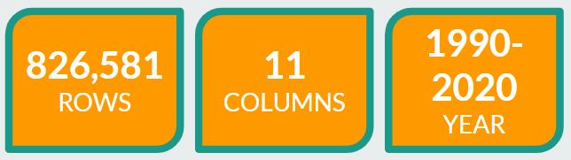
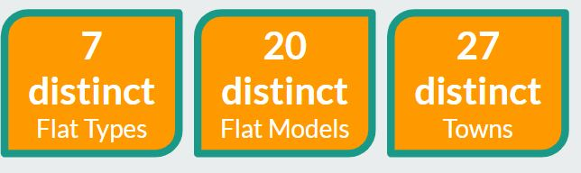
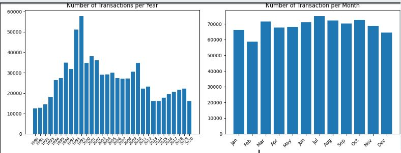
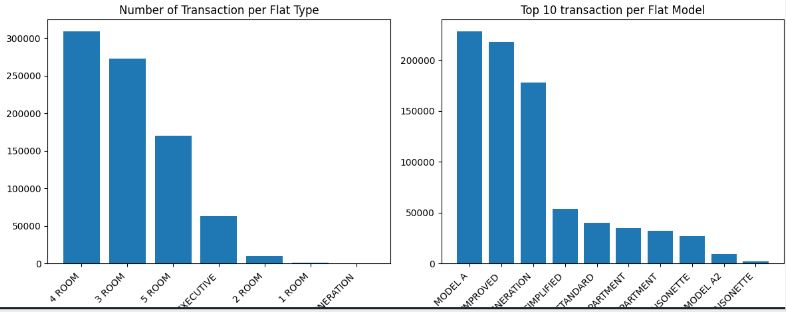

# itd214_HDB_recommendation
This is a recommendation model using Association rules which connects to a streamlit application where user selects the preferences. There are 2 main files 1015618c_Reccomendation_prep.ipynb which you have to run as it will generate the dataset called output.csv and stored in the output_data directory, and also generate a copy of the model association_rules.pkl into  the model directory.

This 2 items output.csv and association_rules.pkl needs to be created first before we can use hdb_recommendation_app.py to run the streamlit application.

To run the streamlit application go to the website https://hassan-hosain-hdb-recommendation-fpgrowth.streamlit.app/

---
layout: post
author: Hassan Hosain
title: "Applied Data Science Project Documentation"
categories: ITD214
---
## Project Background
Our team worked on the the HDB resale prices, as we realise couples in Singapore require insights into the every increasing cost of HDB resale prices in Singapore. Therefore to give some form of insights to HDB purchase prices will be extremely helpful.

Thus our business objective is "Empowering married couples with predictive insights into HDB resale prices to best prepare them in decision-making and strategic planning."
The individual objective for me to provide a form of recommendation model to the married couples by delving into the data and see which flats wil be suitable for them.

## Work Accomplished
I manage to create a Streamlit application which consist a few drop down fields (distance to mrt, town location, floor area, flat type and etc) that the users can select. The fields are non mandatory and they may select No preference as the option. Once the user selects the required fields and click submit. The Streamlit application will then communicate with the model.

The model is an association rule model, using the FPGrowth algorithm. FP-Growth is an alternative to Apriori that avoids the costly candidate generation step by using a compact data structure called the FP-tree (Frequent Pattern Tree). It recursively extracts frequent itemsets from the tree structure.

**Benefits of FP-Growth are:**
- More efficient than Apriori algorithm, especially for large datasets with many items and transactions.
- Reduces the need to scan the database multiple times.

### Data Exploration
In the 1015618c_Reccomendation_prep.ipynb file, firstly i did some exploratory analysis first to understand better, utilizing libraries like pandas, numpy, matplotlib etc. There are 5 csv files, and went merged there are a total of 826,581 rows, 11 columns, year spanning from 1990-2020, 7 unique flat types, 20 unique flat models and 27 unique towns in the dataset.
 

I have also plotted visualization barcharts to showcase in year 1997,1998 thera are huge spikes of transactions of hdb purchases , but the average throughout the months is mostly consistent.

Observations like the 4-room flats followed by 3-room flats are most popular flat types, also Model A, Improved is the top 2 popular flat models.

### Data Preparation
After observation I cleaned the data such as found inconsistencies such as flat_type column having ('2-room', '2-ROOM') , and in flat_model ('MULTI GENERATION','MULTI-GENERATION'), which was corrected by making flat_type to all be upper case and adding hyphen to 'MULTI-GENERATION'.

I split the column month, into transaction_year and transaction_month. As month consited a year month date.

I also removed null values found in the 'remaining_lease' column which i create a new calculated column 'new_remaining_lease' with the calculation 99 minus (transaction_year - lease_commence_date). With the assumption that 99 years are the maximum lease duration. And dropped the old 'remaining Lease' column.

For the model i combined the 'block' column and the 'street_name' column into the 'address' column. This will be used for the OneMAP API. Then only extract out the unique address into a list.

This unique list of address then is used in the OneMap API to be passed to get the latitude and longtitude of the hdb flats and store it in a new dataframe called geolocation_df.

Extract a mrt_staions.csv this file was extracted from the website https://mrtmapsingapore.com/mrt-stations-singapore/ where they list the different mrt_stations. I also use the OneMAP API to get the mrt stations latitude and longitude.

use both hdb latitude and longitude as coordinates and the mrt stations coordinates, to search which mrt stations are nearest to each distinct address, this is also stored in the geolocation_df which will be all combined into the main dataframe model_combined_df.

Save the clean data to the ./output_data/output.csv

### Modelling : Association rule
Still in the 1015618c_Reccomendation_prep.ipynb file, using mlxtend.frequent_patterns library cut certain categories for the feature selection like floor_area_sqm which maps the feature into bin groups and rename the column as floor_area_category. Did it for other categories like price_category, distance_to_mrt_category and new_remaining_lease_category.

Then drop columns that are repeated like floor_area_sqm, resale_price etc. as this has been replaced by the categories above.

Next I do one hot encoding using pd.getdummies() this converts the categories into numerical 1 and 0s.

Then i encode the dataframe using the fpgrowth function to allow tolerance of the min_support, and also the association function to allow only confidence score up to a certain threshold.

This model is saved as .pkl file into the model directory.

### Evaluation
Before FP-Growth algorithms I tested out another association model algorithm called apriori whic was very slow in processing the dataset, after researching found out FP-Growth algorithm was a better recommendation on how it handles huge datasets as it does not need to constantly iterate through the dataset.

I also tested and tune the model hyper parameters by adjusting the min_support and confidence variables, in accordance with what i want the association rule model to show.

Once I am satisfied with the model and save it into the model directory, the hdb_recommendation_app.py is the file that creates the streamlit web application that reads the model and dataset and list out drop down fields for the user to select. On which if the user submits the selected fields then the recommended hdb flats will appear in the results.

## Recommendation and Analysis
Explain the analysis and recommendations

Lorem ipsum dolor sit amet, consectetur adipiscing elit. Fusce bibendum neque eget nunc mattis eu sollicitudin enim tincidunt. Vestibulum lacus tortor, ultricies id dignissim ac, bibendum in velit. Proin convallis mi ac felis pharetra aliquam. Curabitur dignissim accumsan rutrum. In arcu magna, aliquet vel pretium et, molestie et arcu. Mauris lobortis nulla et felis ullamcorper bibendum. Phasellus et hendrerit mauris. Proin eget nibh a massa vestibulum pretium. Suspendisse eu nisl a ante aliquet bibendum quis a nunc. Praesent varius interdum vehicula. Aenean risus libero, placerat at vestibulum eget, ultricies eu enim. Praesent nulla tortor, malesuada adipiscing adipiscing sollicitudin, adipiscing eget est.

## AI Ethics
Discuss the potential data science ethics issues (privacy, fairness, accuracy, accountability, transparency) in your project. 

The potential data science ethics issues are the possibility that the actual dataset will contain buyers personal information like full name, d.o.b , age, residence, salary, identification number and etc. In Singapore context this are PDPA information and should be masked out or removed from the dataset completely if not required.
If these personal information is required to be used then permission from the end user is required. Therefore proper procedures when collecting, storing and processing must comply with the PDPA regulation so that no personal identifiable infomation (PII) is exposed.

Bias of data can also pose problems if the dataset contains of buyers of a certain age group, or if the dataset contains only married couples and if the model is being used for single owner buyers it may affect the model and mislead the users completely.

Since the business objective is for married couples, this dataset should be only consist of buyers who are married couples, and also that this model should only be utilized for married couples to retain the fairness and inform this information to the end user allows transparency.

## Source Codes and Datasets
https://github.com/HassanHosain/itd214_HDB_recommendation/tree/main
Upload your model files and dataset into a GitHub repo and add the link here. 
